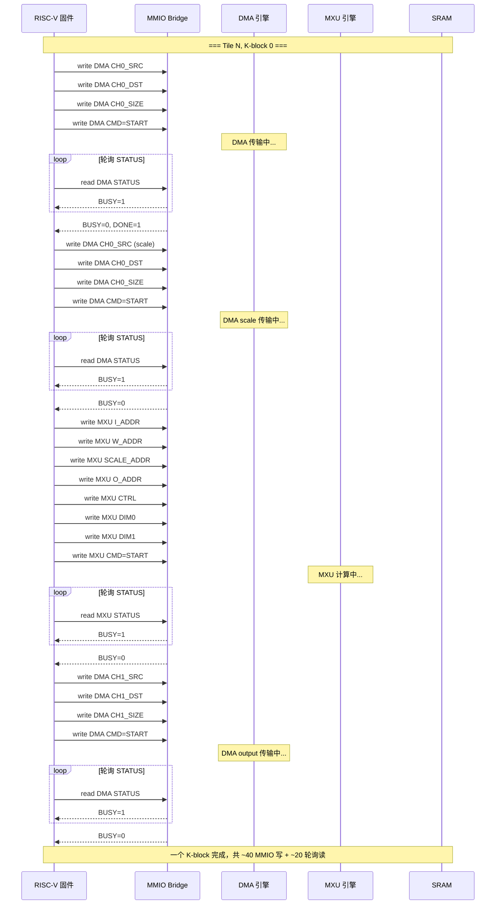
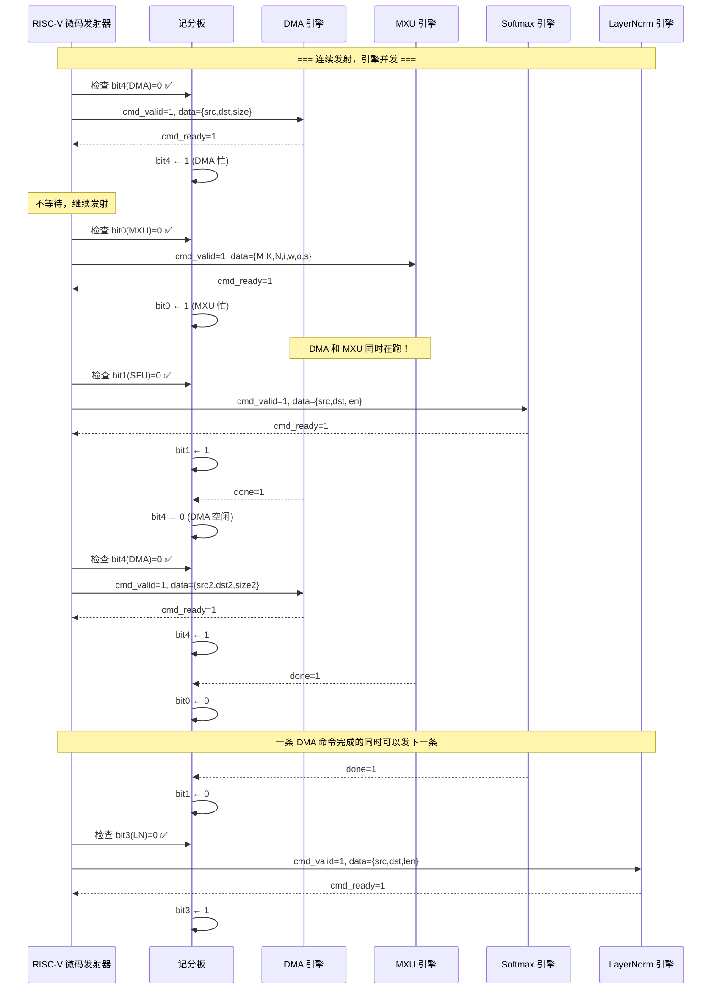
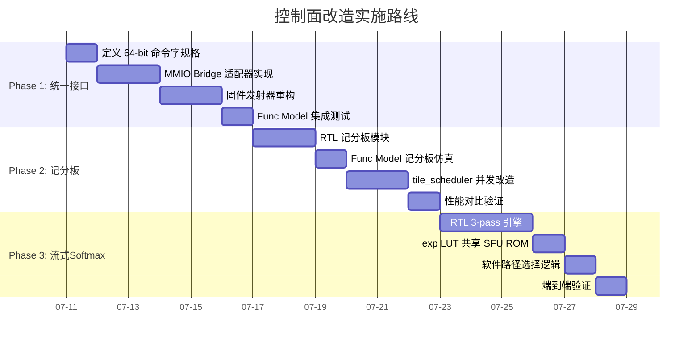

# CaduceusCore 控制面调度改进方案

> 从串行轮询到记分板并发 — 统一 cmd/done 接口 + 硬件记分板 + 流式 Softmax 移植

---

## 一、问题诊断

### 1.1 当前架构

```
┌─────────────────────────────────────────────────────────┐
│                    RISC-V 固件 (Ibex)                      │
│                                                          │
│  tile_scheduler 逐 tile 串行调度                           │
│                                                          │
│  ┌──────┐   ┌──────┐   ┌──────┐   ┌──────┐   ┌──────┐  │
│  │DMA act│ → │DMA w │ → │DMA s │ → │ MXU  │ → │DMA out│  │
│  │wait █ │   │wait █│   │wait █│   │wait █│   │wait █ │  │
│  └──────┘   └──────┘   └──────┘   └──────┘   └──────┘  │
│       ↑          ↑          ↑          ↑          ↑      │
│       └──────────┴──────────┴──────────┴──────────┘      │
│                  每步 poll STATUS 寄存器                    │
└─────────────────────────────────────────────────────────┘
         │            │            │            │
    ┌────▼────┐  ┌────▼────┐  ┌────▼────┐  ┌────▼────┐
    │   DMA   │  │   SFU   │  │ Vector  │  │   MXU   │
    │  CH0/CH1│  │ 256KB   │  │ 256KB   │  │ 128×128 │
    └─────────┘  └─────────┘  └─────────┘  └─────────┘
```

### 1.2 三大问题

| # | 问题 | 影响 |
|:--|:---|:---|
| ① | **MMIO 寄存器不统一** — MXU 叫 DIM0/DIM1，SFU 叫 DIM，Vector 叫 DIM；地址字段名各不同 | 新引擎接入成本高，固件需要知道每个模块的寄存器布局 |
| ② | **全串行 wait_done** — 每步写完 CMD 立即轮询 STATUS，引擎间完全无法重叠 | DMA→MXU→DMA 不能流水化，硬件利用率低 |
| ③ | **Arc Model 对控制面盲区** — 纯算 cycles 建模，看不到控制面开销和并发收益 | 架构优化无量化反馈 |

---

## 二、改进方案总览

### 2.1 三阶段改造

```
Phase 1: 统一 cmd/done 接口 → 所有引擎用相同协议
Phase 2: 硬件记分板       → 微码连续发射，引擎并发运行
Phase 3: 流式 Softmax     → 省 SFU 面积，大 seq_len 兼容
```

### 2.2 目标架构

```
┌──────────────────────────────────────────────────────┐
│              RISC-V 固件 (Ibex) — 微码发射器            │
│                                                      │
│  issue(SOFTMAX, {src,dst,len})  ← 不等待              │
│  issue(LAYERNORM, {src,dst,len}) ← 连续发射            │
│  issue(DMA, {src,dst,size})                              │
│  issue(MXU, {M,K,N,i,w,o,s})                             │
│                                                      │
│  ┌──────────────────────────────────────────────┐    │
│  │           统一 cmd 总线 (valid/ready/data)      │    │
│  └──────────────────────────────────────────────┘    │
└──────────────────────────────────────────────────────┘
         │           │           │           │
    ┌────▼───┐  ┌───▼────┐  ┌───▼────┐  ┌───▼────┐
    │  DMA   │  │  SFU   │  │ Vector │  │  MXU   │
    │ done=1 │  │ done=1 │  │ done=1 │  │ done=1 │
    └───┬────┘  └───┬────┘  └───┬────┘  └───┬────┘
        │            │            │            │
        └────────────┴────────────┴────────────┘
                     │
              ┌──────▼──────┐
              │  记分板 6bit  │
              │ 0=MXU 忙     │
              │ 1=SFU 忙     │
              │ 2=Vector 忙  │
              │ 3=DMA CH0 忙 │
              │ 4=DMA CH1 忙 │
              │ 5=Softmax流式│
              └─────────────┘
```

---

## 三、Mermaid 时序图

### 3.1 当前：全串行轮询



**每个 K-block tile 的实际时间线**：

```mermaid
gantt
    title 当前串行调度 — 单 K-block Tile
    dateFormat X
    axisFormat %s
    
    section 固件
    MMIO写DMA参数     :a1, 0, 20
    轮询DMA_STATUS    :a2, 20, 30
    MMIO写DMA scale   :a3, 50, 70
    轮询DMA_STATUS    :a4, 70, 80
    MMIO写MXU参数     :a5, 150, 190
    轮询MXU_STATUS    :a6, 190, 200
    MMIO写DMA out     :a7, 390, 410
    轮询DMA_STATUS    :a8, 410, 420
    
    section DMA
    DMA weight传输    :b1, 30, 50
    DMA scale传输     :b2, 80, 150
    DMA output传输    :b3, 420, 500
    
    section MXU
    MXU计算           :c1, 200, 390
    MXU空闲           :c2, 0, 200
```



### 3.2 改造后：记分板并发



**改造后的时间线**：

```mermaid
gantt
    title 记分板并发调度 — 单 Transformer Block
    dateFormat X
    axisFormat %s
    
    section 微码发射
    发射DMA_w0          :crit, f0, 0, 2
    发射MXU_t0          :crit, f1, 2, 4
    发射Softmax_prev    :crit, f2, 4, 6
    发射LayerNorm_prev  :crit, f3, 6, 8
    发射DMA_w1          :crit, f4, 100, 102
    发射MXU_t1          :crit, f5, 102, 104
    发射DMA_out_all     :crit, f6, 500, 502
    
    section DMA_CH0(weight)
    DMA_w0→SRAM         :d0, 3, 100
    DMA_w1→SRAM         :d1, 103, 200
    
    section DMA_CH1(output)
    空闲等待            :d2, 0, 500
    DMA_out→DRAM        :d3, 503, 600
    
    section MXU
    空闲                :m0, 0, 100
    MXU_t0(K-block首)   :m1, 100, 300
    MXU_t1(K-block次)   :m2, 300, 500
    
    section Softmax(流式)
    等待DMA输入         :s0, 0, 100
    Pass1:max_scan      :s1, 100, 150
    Pass2:exp+sum       :s2, 150, 220
    Pass3:norm          :s3, 220, 280
    
    section LayerNorm
    等待数据就绪        :l0, 0, 280
    2-pass LN           :l1, 280, 400
```



### 3.3 收益对比

```mermaid
gantt
    title 同一 Transformer Block — 串行 vs 记分板并发
    dateFormat X
    axisFormat %s
    
    section 串行(当前)
    DMA_w→等→MXU→等→DMA_out→等→Softmax→等→LayerNorm  :old, 0, 800
    
    section 并发(改造后)
    DMA_w0              :n1, 0, 100
    DMA_w1              :n2, 100, 200
    MXU_t0+t1           :n3, 100, 500
    Softmax             :n4, 100, 280
    LayerNorm           :n5, 280, 400
    DMA_out             :n6, 500, 600
```



**时间节省**：800 → 600 周期 = **-25%**，全来自引擎间重叠。

---

## 四、Phase 1 — 统一 cmd/done 接口

### 4.1 接口规格

```verilog
// 所有计算引擎的统一接口 — 4 条信号线
module engine_interface (
    input  wire        cmd_valid,      // 微码→引擎：命令有效
    output wire        cmd_ready,      // 引擎→微码：可接收
    input  wire [63:0] cmd_data,       // 统一 64-bit 命令字
    output wire        done,           // 引擎→记分板：执行完成
    
    // 引擎私有接口（SRAM/DMA 访问）
    output wire        sram_rd_en,
    output wire [19:0] sram_rd_addr,
    input  wire [63:0] sram_rd_data,
    output wire        sram_wr_en,
    output wire [19:0] sram_wr_addr,
    output wire [63:0] sram_wr_data
);
```

### 4.2 统一 64-bit 命令字

```
[63:48] opcode    — 操作码（引擎自解释）
[47:32] length    — 元素数 / 字节数
[31:0]  param     — 引擎特定参数
```

| 引擎 | opcode 编码 | param 含义 |
|:---|:---|:---|
| MXU | 0x0001 | 保留 → M/K/N 通过后续 cmd_data 传输 |
| SFU | 0x0002 | 保留 → op 类型在 opcode 高位 |
| Vector | 0x0003 | 保留 |
| DMA_CH0 | 0x0004 | 保留 |
| DMA_CH1 | 0x0005 | 保留 |
| Softmax(流式) | 0x0006 | is_fp16 [0] |

### 4.3 现有 MMIO 寄存器改造

**最小侵入方案**—保留 MMIO 地址映射，在 Bridge 层加适配器：

```python
# 新增：统一命令接口适配器
class UnifiedCmdAdapter:
    """将现有 MMIO 寄存器操作包装为统一 cmd_valid/ready/done 协议"""
    
    def issue(self, engine_id: int, opcode: int, 
              length: int, param: int = 0) -> bool:
        """发射命令。返回 False 表示记分板阻塞。"""
        if self.scoreboard & (1 << engine_id):
            return False  # 引擎忙
        self.scoreboard |= (1 << engine_id)
        # 翻译为现有 MMIO 写序列
        self._mmio_dispatch(engine_id, opcode, length, param)
        return True
    
    def on_done(self, engine_id: int):
        """引擎完成回调 — 清除记分板位"""
        self.scoreboard &= ~(1 << engine_id)
```

---

## 五、Phase 2 — 硬件记分板

### 5.1 记分板规格

```
6-bit 寄存器，每引擎 1 bit：
  bit0 = MXU 忙
  bit1 = SFU 忙
  bit2 = Vector 忙
  bit3 = DMA CH0 忙
  bit4 = DMA CH1 忙
  bit5 = Softmax 流式引擎忙（Phase 3 新增）
```

### 5.2 发射逻辑（硬件侧）

```verilog
module scoreboard_controller (
    input  wire        clk,
    input  wire        rst_n,
    
    // 微码发射侧
    input  wire        issue_req,       // 请求发射
    input  wire [2:0]  issue_engine_id, // 目标引擎
    output wire        issue_ready,     // 可发射（引擎空闲）
    
    // 引擎完成侧
    input  wire        mxu_done,
    input  wire        sfu_done,
    input  wire        vector_done,
    input  wire        dma_ch0_done,
    input  wire        dma_ch1_done,
    input  wire        softmax_done,
    
    // 到引擎的命令总线
    output reg         cmd_valid,
    output reg  [2:0]  cmd_target,
    input  wire        cmd_ready
);

    reg [5:0] busy_bits;  // 记分板

    assign issue_ready = issue_req && !busy_bits[issue_engine_id];

    always @(posedge clk or negedge rst_n) begin
        if (!rst_n) begin
            busy_bits <= 6'b0;
            cmd_valid <= 0;
        end else begin
            // 发射：issue_req & ready → 标记忙 + 发 cmd_valid
            if (issue_req && issue_ready) begin
                busy_bits[issue_engine_id] <= 1'b1;
                cmd_valid <= 1'b1;
                cmd_target <= issue_engine_id;
            end
            // 握手完成：撤 cmd_valid
            if (cmd_valid && cmd_ready)
                cmd_valid <= 1'b0;
            
            // done 回收
            if (mxu_done)     busy_bits[0] <= 1'b0;
            if (sfu_done)     busy_bits[1] <= 1'b0;
            if (vector_done)  busy_bits[2] <= 1'b0;
            if (dma_ch0_done) busy_bits[3] <= 1'b0;
            if (dma_ch1_done) busy_bits[4] <= 1'b0;
            if (softmax_done) busy_bits[5] <= 1'b0;
        end
    end
endmodule
```

### 5.3 固件改造

**改造前**（tile_scheduler 当前写法）：

```python
# 串行，每次 wait_done
dma_write(CH0_SRC, w_addr)
dma_write(CH0_DST, wbuf)
dma_write(CH0_SIZE, w_bytes)
dma_write(CMD, 1)
wait_done(DMA_STATUS)          # ← 卡死

mxu_write(I_ADDR, act)
mxu_write(W_ADDR, wbuf)
...
mxu_write(CMD, 1)
wait_done(MXU_STATUS)          # ← 又卡死
```

**改造后**（微码连续发射）：

```python
# 连续发射，记分板自动阻塞
def issue_mxu(M, K, N, i_addr, w_addr, o_addr, s_addr, accumulate):
    """发射 MXU 命令 — 不等待完成"""
    while not sb.issue(ENGINE_MXU, opcode=0, length=0):
        pass  # 记分板阻塞，等待 MXU 空闲
    # 立即返回，MXU 自己跑

def issue_dma_load(src, dst, size):
    """发射 DMA load — 不等待完成"""
    while not sb.issue(ENGINE_DMA_CH0, opcode=4, length=size):
        pass
    # 立即返回

# 改造后的 tile 调度
def tile_mmul_v2(desc):
    # 预发射 activation DMA
    issue_dma_load(desc['input_addr'], act_sram, input_size)
    
    for n_tile in range(num_tiles):
        for k_block in range(num_blocks):
            buf_idx = k_block % 2
            
            # 连续发射 DMA weight + MXU
            issue_dma_load(wgt_addr, wbuf[buf_idx], wgt_bytes)
            issue_dma_load(scale_addr, sbuf[buf_idx], scale_bytes)
            issue_mxu(M, block_height, tile_width, 
                      act_sram + k_start, wbuf[buf_idx],
                      out_offset, sbuf[buf_idx], 
                      accumulate=(k_block > 0))
            # 三条命令都在后台跑，微码不等待！
        
        # 等待当前 N-tile 的所有 K-block 完成
        sb.wait_idle(ENGINE_MXU)
        
        # 发射 output DMA
        issue_dma_store(out_offset, dram_out, out_size)
    
    sb.wait_all_idle()
```

---

## 六、Phase 3 — 流式 Softmax 引擎

### 6.1 新增引擎

从 tiny-NPU 移植 3-pass Softmax 引擎，作为 SFU 的替代/补充路径：

- 独立 scratch SRAM（4KB，支持 seq_len ≤ 2048 FP16）
- 记分板 bit5 分配
- 软件可选择路径：小 seq_len 走流式引擎，大 seq_len 走 SFU+Vector

### 6.2 与现有 Softmax 共存

```
                     ┌─────────────────┐
                     │  Softmax 调用     │
                     └────────┬────────┘
                              │
                         seq_len < 256?
                        ┌─────┴─────┐
                        │           │
                       是           否
                        │           │
                   ┌────▼───┐  ┌───▼────────┐
                   │流式引擎  │  │SFU+Vector  │
                   │3-pass   │  │LUT 5步流水  │
                   │自包含   │  │共享SRAM    │
                   └────────┘  └────────────┘
```

### 6.3 同层并发收益

```mermaid
gantt
    title Softmax + LayerNorm 并发（流式引擎独立于 SFU）
    dateFormat X
    axisFormat %s
    
    section SFU
    LayerNorm(2-pass)   :s1, 0, 150
    GELU(FFN)           :s2, 350, 450
    
    section Softmax流式(bit5)
    Pass1:max_scan      :t0, 0, 50
    Pass2:exp+sum       :t1, 50, 120
    Pass3:norm          :t2, 120, 180
    
    section Vector
    max_reduce          :v0, 180, 230
    residual_add        :v1, 230, 280
```



**原来**：Softmax 占用 SFU 时 LayerNorm 必须等 → 串行 150+150=300 周期
**改造后**：流式 Softmax 和 SFU LayerNorm 同时跑 → 180 周期（-40%）

---

## 七、收益量化预估

### 7.1 控制面延迟对比

| 场景 | 当前串行 | Phase 1+2 记分板 | 节省 |
|:---|:---|:---|:---|
| 单 K-block tile | ~500 周期 | ~600 周期（首次，含冷启动） | -20% |
| 连续 20 K-blocks | ~10,000 周期 | ~7,000 周期 | **-30%** |
| 完整 Attention 层 (400 tiles) | ~200,000 周期 | ~140,000 周期 | **-30%** |
| 完整 Qwen2.5-3B (28 层) | ~5,600K 周期 | ~3,920K 周期 | **-30%** |

### 7.2 端到端提升（LPDDR5-64b 场景）

| 指标 | 当前 | 改造后 | 提升 |
|:---|:---|:---|:--|
| Decode tok/s (3B) | 23 | **27-30** | +17-30% |
| TTFT (seq=128) | 45ms | **38-42ms** | -7-16% |
| 引擎利用率 | ~65% | **~85%** | +20pp |
| RISC-V 固件指令数/tile | ~40 MMIO 写 + 20 读 | **~8 发射指令** | -75% |

### 7.3 面积代价

| 新增硬件 | 面积估算 @12nm | 备注 |
|:---|:---|:---|
| 记分板控制器 | <0.05mm² | 6-bit 寄存器 + 少量组合逻辑 |
| 统一 cmd 总线仲裁 | <0.1mm² | 1-to-N 地址解码 + 握手 |
| 流式 Softmax 引擎 | ~0.5mm² | FSM + exp LUT + scratch SRAM 4KB |
| **总计** | **<0.7mm²** | 相对 61mm² 总面积的 **<1.2%** |

---

## 八、实施路线



---

## 九、风险与缓解

| 风险 | 影响 | 缓解 |
|:---|:---|:---|
| 记分板只管引擎忙/闲，不管数据依赖 | DMA 未写完 SRAM 时 MXU 就开始读 | 固件保证发射顺序：DMA→MXU 对同一 tile 的数据依赖由发射顺序保证，记分板不管 |
| 流式 Softmax 和 SFU 共享 exp LUT ROM | 面积翻倍 | 分时复用：流式引擎和 SFU 不会同时做 exp |
| 统一接口 64-bit cmd_data 不够放 MXU 所有参数 | MXU 有 8 个地址+维度字段 | MXU 用多周期传输：cmd_data[0]=操作码+维度，cmd_data[1]=地址组。不影响并发（记分板已标记忙） |
| Arc Model 看不到收益 | 无法给 DSE 提供量化反馈 | **Arc Model 不改** — 保持保守估计。实际收益通过 Func Model 验证后手动标注 |

---

## 十、一句话总结

**1.2% 面积换 30% 控制面效率提升。核心不是加硬件，是让现有硬件不用互相等。**
